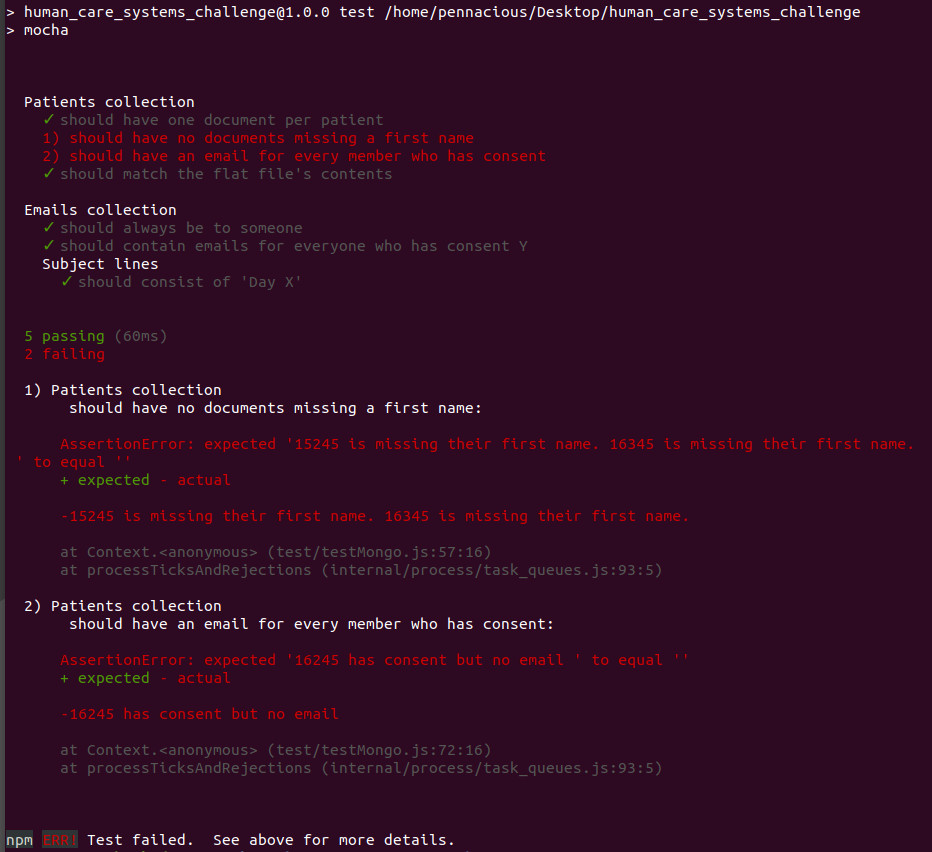

A challenge given to me as part of the Human Care Systems interview process.
To see requirements, see SQE_Engineer_Challenge.docx in the repository.

To setup and run this repository, you need NodeJS, npm, and a mongoDB localhost.

Once you've cloned and moved into the repository, use these commands:
 1. **npm i** to install all of the required packages
 2. **npm run setup** to create and populate the collections
 3. **npm test** to run the tests and see the results in your console.

I used Mocha and Chai to run the tests, so they document as they run.

They point out what's wrong and where.
